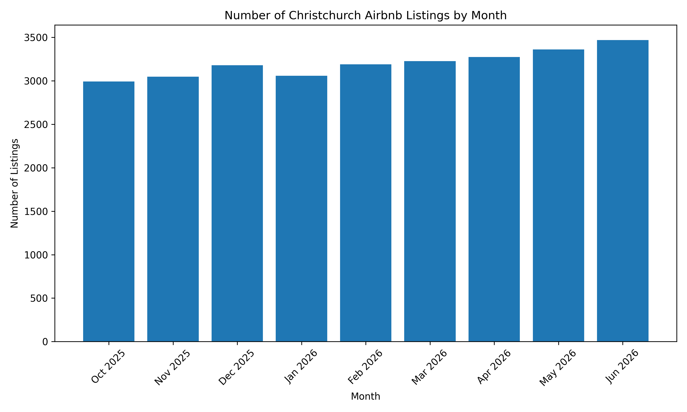
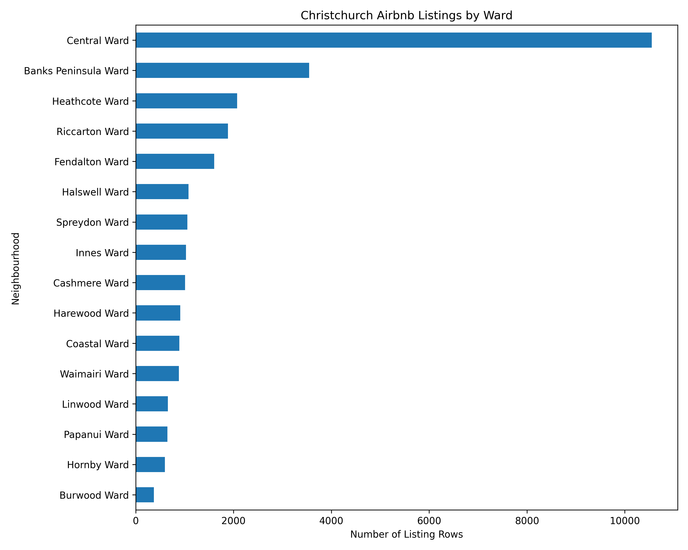
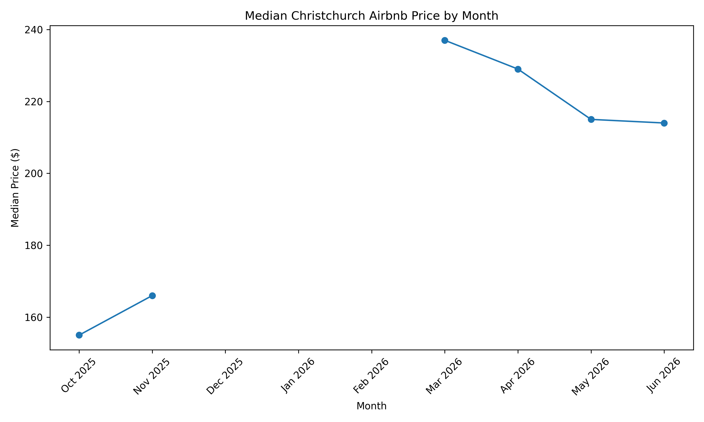
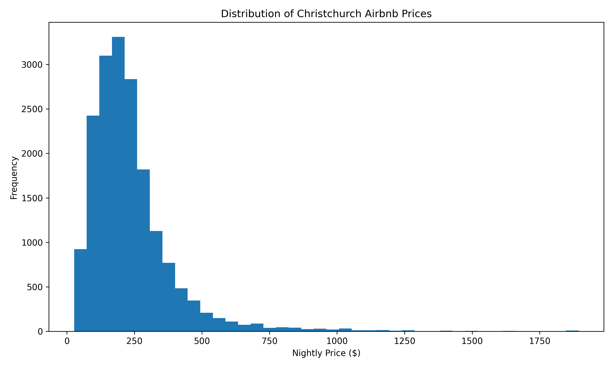

# Deliverable 3

## Python Workflow

The Python workflow:

- Loaded all monthly Airbnb datasets (October 2025 – June 2026)
- Filtered to Christchurch City
- Added a `month_year` column
- Combined all monthly datasets
- Produced summary statistics
- Calculated missing values
- Saved the processed dataset
- Created visualisations
- Reproduced the workflow in Orange Data Mining

---

## Number of Christchurch Listings by Month

This graph shows that the number of Christchurch Airbnb listings generally increased between October 2025 and June 2026.

---

## Listings by Christchurch Ward

Central Ward contains the highest number of Airbnb listings by a considerable margin.

---

## Median Price by Month

Median nightly prices could not be calculated for December 2025, January 2026 and February 2026 because those monthly datasets contained missing price values.

---

## Distribution of Airbnb Prices

Most Christchurch Airbnb listings are priced between approximately \$100 and \$300 per night, with relatively few expensive listings.

---

## Distribution of Room Types

Entire home/apartment listings are by far the most common room type in Christchurch.